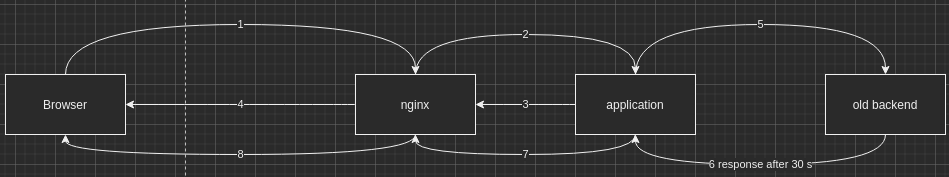

== Example for long-running tasks

Problem:

* long-running task of application leads to timeout in nginx

[source,shell script]
----
browser http://localhost/
browser http://localhost/longRunning
# gets a timeout after 60 seconds
# 504 Gateway Time-out
----

== Further info

https://docs.spring.io/spring-framework/docs/current/javadoc-api/org/springframework/web/servlet/mvc/method/annotation/StreamingResponseBody.html

when using this option it is highly recommended to configure explicitly the TaskExecutor used in Spring MVC for executing asynchronous requests

